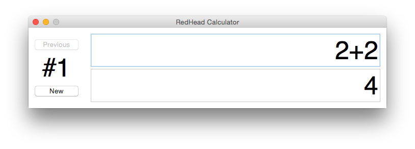

# Navod na pouziti

## Seznam matematickych operaci
Operace|Syntaxe|Priklad
---|---|---
Sčítání | + | 3+5=8
Odčítání | - | 3-5=2
Dělení | / | 3/5=0.6
Zbytek po deleni | % | 3%5=3
Mocnina | ^ | 3^2=9
Faktorial | ! | 3!=6
Zaokrouhlení dolů | ~ | ~3.5=3

## Pouzity grafickeho rozhrani

 

Kalkulacka ma seznam vysledku. Indexace vysledku zacina se od #1. Na leve strane mame navigace mezi vypocty.

Na prave strane mame dva pole. Pole dolu je readonly a slouzi pro vysledek. Uzivatel zada vstup do pole nahore. Rozhodli jsme neimlementovat klavisnice tlacitek, protoze mame implementace v Pythonu a je urcena pro desktopy. Z predmetu ITU jsem vime, ze mene elementu uzivatelskeho rozhrani je lepsi cesta. Kalkulacka vyuziva live-update vysledku podle vstupu uzivatelu.

## Spusteni, instalace, testovani

Instalace realizovana pomoci standrtni funkcionality Python - pomoci setuputils. Tkinter, ktery slouzi pro implementace GUI neni predstaven v PyPi repositare, a je pripadne potrba nainstalovat pomoci aptitude.
	
	sudo apt-get install python3-tk
	
Ale, tkinter je soucast standartni distribuce Python, a toto je potreba jen v pripade exoticke/stare instalace Python.

Vytvorili jsme taky Makefile, ktery ma tuto funkcionalitu:

	make

Vytvary build adresar pomoci setup.py

	make run

Spusti kalakulacku s grafickym rozhranim.

	make install

Nainstaluje matematickou knihovnu (bude dostupna pomoci `import mathlib`). Vytvari prikaz `rhclac`, ktery spusti kalkulacky.

	make uninstall

Odinstaluje knihovnu a rhcalc.

	make doc

Vygeneruje dokumentaci pomoci doxygenu.

	make test
Spusti unit testy matematicke knihony

	make clean

Vycisty build, dokumentace atd.